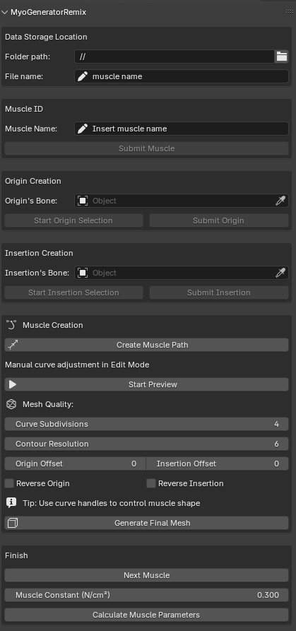

# MyoGeneratorRemix - Blender Add-On

[](https://github.com/MiguelDLM/MyoGeneratorRemix/releases/latest)
[](https://github.com/MiguelDLM/MyoGeneratorRemix/releases)
[](https://www.blender.org/)
[](https://www.gnu.org/licenses/gpl-3.0)


**Advanced Blender add-on for creating anatomically accurate volumetric muscle meshes using Bezier curve-based lofting**.

MyoGeneratorRemix is a completely redesigned version of the original MyoGenerator add-on by Eva C. Herbst and Niccolo Fioritti. This remix takes full advantage of modern Blender features and implements a robust, automatic Bezier-based muscle lofting system that fix previous issues during the mesh generation and parameter calculation processes.

## Key Features

- **Automatic Bezier-Based Lofting**: Uses Bezier curve handles for orientation and radius data for local mesh thickness
- **Smart Curve Detection**: Automatically detects changes in Bezier curve structure and regenerates mesh accordingly
- **Streamlined Workflow**: Minimal user input required for muscle creation
- **Comprehensive Metrics**: Exports detailed CSV files with muscle measurements and properties
- **Procedural Muscle Materials**: Automatically applies realistic muscle textures with subsurface scattering



## Installation

### Requirements
- Developed and tested on Blender 4.4.3 ([Download Blender](https://www.blender.org/))

### Installation Steps
1. Download the latest release ZIP file from the [GitHub repository](https://github.com/MiguelDLM/MyoGeneratorRemix/releases)
2. In Blender, go to **Edit > Preferences > Add-ons**
3. Click **Install from disk** (right upper corner dropdown menu)and select the downloaded ZIP file or navigate to the `AddonFolder` directory
4. Enable the add-on by checking the box next to "MyoGeneratorRemix"
5. The add-on panel will appear in the 3D Viewport sidebar (press `N` to toggle sidebar)

## Workflow

### Initial Setup
1. Start with a new Blender file
2. Import your bone meshes (preferably cleaned models with no intersecting faces or non-manifold edges)
3. Verify your model is at correct scale (Usually, anatomical models such as CT models are in millimeters but Blender uses meters as default unit, so you may assume that 1 Blender unit = 1 millimeter)
4. Keep all objects visible during the muscle creation process

### Creating Muscles

#### 1. Data Setup
- **Folder Path**: Choose where to save your muscle data and CSV files
- **File Name**: Set the base name for your output files
- **Muscle Name**: Enter a unique name for each muscle

#### 2. Origin Creation
- **Select Origin Bone**: Choose the bone where the muscle originates
- **Start Origin Selection**: Enter face selection mode
- **Select Attachment Area**: Use lasso tool to select the muscle attachment faces
- **Submit Origin**: Confirm your selection

#### 3. Insertion Creation
- **Select Insertion Bone**: Choose the bone where the muscle inserts
- **Start Insertion Selection**: Enter face selection mode  
- **Select Attachment Area**: Select the muscle insertion faces
- **Submit Insertion**: Confirm your selection

#### 4. Curve and Mesh Generation
- **Create Muscle Curve**: Generates a Bezier curve between origin and insertion centroids
- **Adjust Curve**: Modify the curve shape, handles, and radius as needed. You can add or remove points to refine the muscle path at this stage.
- **Preview Muscle**: Generate a preview mesh to see the results and refine the curve if necessary
- **Curve subdivision**: Adjust the curve resolution for smoother mesh generation
- **Contour resolution**: Set the number of contour points for each attachment area
- **Origin/Insertion Offset**: Displace the vertices order for a better conection between the origin and insertion areas
- **Reverse origin/insertion**: Optionally reverse the origin and insertion order of the vertices for a better connection

- **Generate Final Mesh**: Create the final muscle mesh with automatic material application
- **Repeat for Additional Muscles**: Use the same workflow to create more muscles as needed

#### 5. Finalization
- **Calculate and export Parameters**: Compute muscle metrics (volume, length, attachment areas, etc.) and export them to CSV files


### Advanced Features

#### Bezier Curve Controls
- **Handle Manipulation**: Adjust curve handles to control muscle path and orientation
- **Radius Adjustment**: Modify point radius to control local muscle thickness
- **Automatic Updates**: Mesh automatically regenerates when curve structure changes

#### Material System
- **Procedural Textures**: Automatic application of realistic muscle materials
- **Subsurface Scattering**: Proper light transmission for organic appearance
- **Fiber Patterns**: Voronoi and noise-based texture patterns simulate muscle fibers

## Output Files

The add-on generates:
- **Muscle Mesh**: High-quality volumetric muscle geometry
- **CSV Metrics**: Comprehensive measurements including:
  - Muscle volume and surface area
  - Origin and insertion areas
  - Centroid coordinates
  - Linear distance (Euclidean distance between centroids)
  - Fiber length (actual muscle path length)
  - Physiological Cross-Sectional Area (average area along the muscle path)
  - Muscle Force (calculated based on PCSA multiplied by a constant factor, e.g., 0.3 N/mm²)

## Organization

All muscle components are automatically organized in Blender collections:
- **Muscles Collection**: Contains all muscle sub collections and objects
- **Muscle Names Collection**: Contains individual muscle objects named according to the specified muscle name


## Tips for Best Results

1. **Clean Geometry**: Ensure bone meshes are manifold with no intersecting faces
2. **Continuous Selection**: Select continuous attachment areas without gaps
3. **Proper Scale**: Verify your model is at correct anatomical scale
4. **Curve Refinement**: Adjust Bezier handles and radius for optimal muscle shape
5. **Iterative Workflow**: Use preview function to refine before final generation

## Citation

If you use this method in your research, please cite the original paper:

```
Herbst, E. C., Meade, L. E., Lautenschlager, S., & Scheyer, T. M. (2022). 
A toolbox for the retrodeformation and muscle reconstruction of fossil specimens in Blender. 
Royal Society Open Science, 9(12), 220519. https://doi.org/10.1098/rsos.220519
```

For this remix version:
```
Díaz de León-Muñoz, E. M. (2025). MyoGeneratorRemix: A Blender Add-On for Creating Volumetric Muscles 
[Computer software]. Retrieved from https://github.com/MiguelDLM/MyoGeneratorRemix
```

## Technical Details

This version implements several advanced computational geometry techniques:
- **Parallel Transport Frames**: Bishop frame algorithm for consistent mesh orientation
- **Bezier Sampling**: High-quality curve discretization for smooth muscle paths
- **Automatic Material Nodes**: Procedural shader networks for realistic muscle appearance
- **Dynamic Mesh Updates**: Real-time mesh regeneration based on curve modifications

## License

This program is free software: you can redistribute it and/or modify it under the terms of the GNU General Public License as published by the Free Software Foundation, either version 3 of the License, or (at your option) any later version.

## Acknowledgments

Based on the original MyoGenerator by Eva C. Herbst and Niccolo Fioritti. 